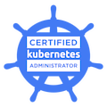

<h1 align="center"> Welcome! 👋 </h1> 

**🤔About me**
- Hi! My name is **Martín Rizzo**
- I'm a Computer Engineer and I'm currently working as Software Engineer at the Centre for the Observation of Natural Risks and Emergencies of the Balearic Islands (RiscBal).
- I love the "systems part": computer architecture, HPC, low level programming, embedded systems and AI.
- Yeah, I believe in Rust supremacy but I also love C/C++, although I'm currently working with Python full time 🙄

**🧰 Languages and tools**
  

    &nbsp;
    &nbsp;
    &nbsp;
    &nbsp;
    &nbsp;
    &nbsp;
  

**🤩 Certifications**

  

    
  

